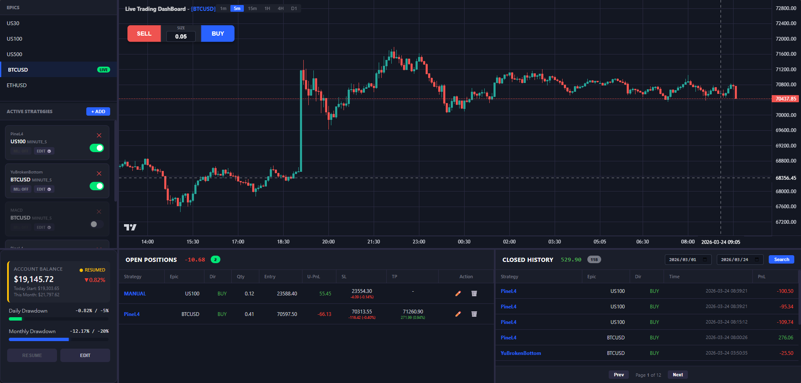
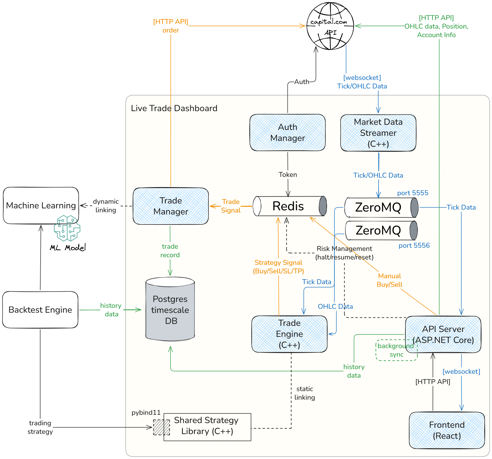
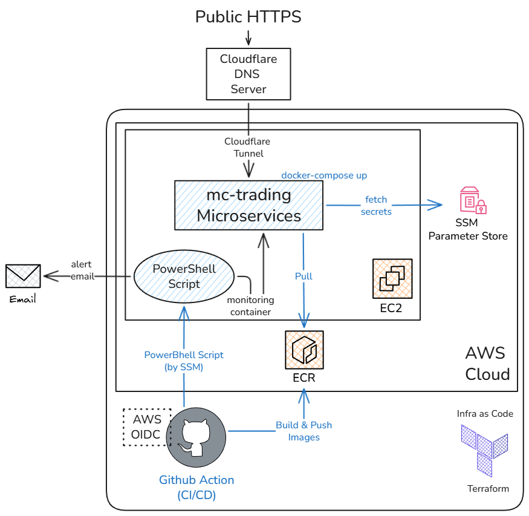

# MC 交易系統：量化交易與回測平台



這是一個針對 Capital.com 券商開發的量化交易/策略開發/回測系統
<br>

## 🚀【核心功能】
- 視覺化交易面板 (線上網頁)
    - 串接 Capital.com 券商帳戶 (使用模擬倉交易)
    - 毫秒級市場行情呈現
    - 帳戶實時損益監控 / 熔斷機制 (以當日/月 MDD 限制執行資金保護)
    - 交易策略自動下單 / 手動平台下單
- 回測系統
    - 多策略組合回測
    - 參數最佳化
    - overfitting 檢驗: WFO, Monte Carlo
    - 實盤績效評估
- 機器學習交易濾網
  - 提取 features 與 labels
  - 使用 Random Forest 訓練模型

<br>

## 🚀【主要技術】
1. 低延遲數據 pipeline (C++)
    - 使用 Boost.Beast 連接券商 WebSocket 進行毫秒時市場數據獲取。
    - 利用 ZeroMQ (PUB/SUB) 執行微服務間通訊，大幅降低行情分發至策略執行的延遲。

2. 共享交易策略 (C++)
    - 交易策略以 C++ 編寫，透過 `pybind11` 在實盤交易引擎(C++) 與回測系統 (python) 之間共享，確保實盤與回測策略邏輯一致與策略低延遲執行。

3. 視覺化交易的 UI 介面 與 風險管理 (C# ASP.NET Core/ React)
    - 整合 TradingView Lightweight Charts 與 Websocket (SignalR) 呈現即時 K 線更新。
    - 使用 ASP.NET Core 建立後端服務，負責熔斷機制/背景執行歷史市場資料/帳戶資訊更新。

4. 量化研究與機器學習濾網 (Python)
    - 整合 VectorBT 量化回測框架，可執行多策略組合回測與參數最佳化。
    - 設計 Machine Learning 交易濾網，利用監督式學習自定義 features/ labels 與利用 RandomForest 演算法訓練模型優化策略績效。
    - 導入 WFO 與 Monte Carlo 模擬，避免策略參數過度擬合。

5. 雲端維運 與 CI/CD
    - 建立 PowerShell Script 監控微服務的狀態，若異常次數累積超過上限，立即寄信給維護人員。
    - 使用 Terraform (IaC) 統一管理雲端資源，實現架構的版本化管理。
    - 透過 GitHub Action 建立 CI/CD，自動 build Docker images 推至 AWS ECR 並部署至 EC2。

6. 基礎設施安全性
    - 整合 AWS SSM 執行遠端指令(無需開放 ssh port，減少被掃描攻擊的風險) 與 Parameter Store 加密儲存所有私鑰。
    - EC2 建立 Cloudflare Tunnel (無需開放 80/443 的 port 即可提供對外服務)。
    - Github Action 透過 AWS OIDC 建立安全連線，避免儲存長期 Access Key 而導致洩漏的風險。
    
<br>

## 🏗️【微服務架構】


1.  **`Auth Manager` (Python)**：
    * 負責券商 (Capital.com) 登入並自動更新驗證 Token。
2.  **`Market Data Streamer` (C++)**：
    * 連接券商數據源，並透過 **ZeroMQ (PUB)** 發布即時 Tick 行情。
3.  **`Trading Engine` (C++)**：
    * 訂閱 **ZeroMQ (SUB)** Tick 與 OHLC 資料，並運行 C++ 交易策略。
4. **`Shared Strategy Library` (C++)**：
    * Static Linking：將策略邏輯直接編譯進 Trading Engine，確保在實盤環境下具備低延遲執行速度與最低的呼叫開銷。
    * Dynamic Linking via pybind11：將相同的交易策略封裝成 .pyd 檔，供 Backtest_Engine 調用，避免回測與實盤的交易策略邏輯不同。
    * 監測 Redis 內的熔斷狀態，確保在風險超標時即時攔截訊號。
4.  **`Api Server` (C# ASP.NET Core)**：
    * 透過 **ZeroMQ (SUB)** 接收 Tick 資料，並負責 WebSocket 的數據分發。
    * 同步即時持倉與損益狀態。
    * 執行與監控資金虧損熔斷機制：
      * halt：達到每日/月設定虧損上限，暫停自動策略/手動下單功能。
      * resume：解除 halt 狀態，恢復自動策略/手動下單功能。
      * reset：每日/月都會重新計算虧損 MDD 值。
    * 背景執行補齊各 Epic 的 K 線歷史資料並存入資料庫。
5.  **`Trade Manager` (Python)**：
    * 訂閱 Redis 的交易訊號，觸發時呼叫 Capital API 建立訂單，並儲存交易紀錄進資料庫。
    * 動態連結 ML 過濾器篩選交易訊號。
6.  **`Redis` & `PostgreSQL`**：
    * 利用 Redis 實現微服務間的通訊 (PUB/SUB) 與 狀態共享。
    * 使用 PostgreSQL 穩定儲存大量交易紀錄與行情數據。
7.  **`Frontend` (React)**：
    * 視覺化交易的 UI 介面，使用 TradingView Lightweight Charts 呈現毫秒級 K 線、持倉明細與交易策略切換。
8.  **`Backtest_Engine` (Python)**：
    * 利用 **VectorBT** 執行高效的向量化回測，支援多策略組合回測、參數最佳化、WFO 與蒙地卡羅測試。
9.  **`Machine Learning` (Python)**：
    * 負責特徵工程採集與訓練 Random Forest 分類模型，預測並過濾潛在的低勝率交易。

<br>

## 🌐【Infrastructure 架構】


1.  **`GitHub Actions(CI/CD)`**：
    * 支援 Git Push Tag 全服務自動化部署 或 Github Action 手動觸發特定服務部署。
    * 透過 AWS OIDC 建立安全連線，直接將指令推送至 AWS EC2。
2.  **`AWS ECR`**：
    * 集中儲存各個微服務的 Docker Image。
    * 設置生命週期管理自動清理舊版本。
3.  **`AWS SSM (Systems Manager)`**：
    * 透過 SSM 執行遠端指令（EC2 無需開放 SSH Port，減少被掃描與攻擊的風險）。
    * 利用 Parameter Store 加密儲存所有私鑰。
4.  **`EC2 & Microservice`**：
    * 利用 Docker Compose 啟動微服務。
5.  **`Cloudflare Tunnel`**：
    * EC2 主機無需開放對外連線埠口。透過 Cloudflare 建立加密隧道，用戶僅能透過經過保護的域名訪問服務，有效防止 DDoS 與惡意掃描。
6.  **`MicroService Health Monitor (PowerShell)`**：
    * 每分鐘監控所有微服務的狀態 與 CPU/Memory 使用率 (< 80%)，一旦連續三次掃描偵測到容器異常，系統會立即發送 email 通知維護人員。
    * 結合 Systemd 守護進程確保服務在異常後能自動恢復。
7. **`Terraform (IaC)`**： 
    * 透過程式碼統一管理雲端資源，實現架構的版本化管理。

<br>

## 📈【回測系統】

### 1. 基本回測
執行單一/多商品回測並生成詳細的[互動式報告](https://mcchouadam.github.io/mc_trading_system_public/documents/Backtest_YuBrokenBottom_PineL4_US100_HOUR_20200101_20250915.html)。
```bash
$ python backtest_engine/run.py --strategy YuBrokenBottom,PineL4 --epics US100 --resolutions HOUR --from 2020-01-01 --to 2025-09-15 --params "RISK_REWARD=5,LOOKBACK_PERIOD=20,RECOVERY_BARS=12,SHADOW_RATIO=0.3;TRAIL_OFFSET=0,RISK_REWARD=3,SHADOW_RATIO=1.5" --cash 10000
```
```bash
[INFO] Successfully loaded C++ Trading Core (mc_strategies)
[INFO] Initialized YuBrokenBottom with params: {'RISK_REWARD': 5, 'LOOKBACK_PERIOD': 20, 'RECOVERY_BARS': 12, 'SHADOW_RATIO': 0.3}
[INFO] Initialized PineL4 with params: {'TRAIL_OFFSET': 0, 'RISK_REWARD': 3, 'SHADOW_RATIO': 1.5}

Running Multi-Strategy Backtest: ['YuBrokenBottom', 'PineL4']
Assets: ['US100'], Resolutions: ['HOUR']
Time Range: 2020-01-01 to 2025-09-15

==================================================
STRATEGY CORRELATION (Daily Returns)
==================================================
                           YuBrokenBottom_US100_HOUR  PineL4_US100_HOUR
YuBrokenBottom_US100_HOUR                    1.00000            0.25544
PineL4_US100_HOUR                            0.25544            1.00000

==================================================
CONSOLIDATED PERFORMANCE SUMMARY (Total Portfolio)
==================================================
Total Return [%]:         29.75%
Max Drawdown [%]:         55.73%
Sharpe Ratio:             0.06
Total Trades:             780
Win Rate [%]:             24.74%
Profit Factor:            1.062
Avg Win Trade:            $263.01 (2.33%)
Avg Loss Trade:           $-81.41 (-0.72%)
Best Trade:               $2425.15
Worst Trade:              $-546.61
Expectancy:               $3.81

--- Generating Consolidated Report ---
DONE: Consolidated Report: \mc_trading_system\backtest_engine\reports\Backtest_YuBrokenBottom_PineL4_US100_HOUR_20200101_20250915.html
DONE: Trades Log: \mc_trading_system\backtest_engine\reports\Trades_YuBrokenBottom_PineL4_US100_HOUR_20200101_20250915.csv
```

<br>

### 2. 參數最佳化 (Parameter Optimization)
系統化遍歷參數組合，從海量市場數據中篩選出歷史績效最優的策略參數配置。
```bash
$ python backtest_engine/run.py --mode optimize --strategy YuBrokenBottom --epics US100 --resolutions DAY --from 2020-01-01 --to 2025-09-15 --opt "RISK_REWARD=1.5:5.0:0.5|LOOKBACK_PERIOD=20:200:40|RECOVERY_BARS=3:15:3|SHADOW_RATIO=0.3:0.8:0.1"
```
```bash
[INFO] Successfully loaded C++ Trading Core (mc_strategies)
[INFO] Initialized YuBrokenBottom with params: {}

Optimizing YuBrokenBottom on US100 DAY...
[INFO] Processing 1398 bars from 2021-03-19 to 2025-09-15
Optimizing Rows: 100%|███████████████████████████████████████████████████████████████████| 1200/1200 [01:35<00:00, 12.61it/s] 

==================================================
TOP 5 PARAMS (YuBrokenBottom on US100 DAY)
==================================================
RISK_REWARD  LOOKBACK_PERIOD  RECOVERY_BARS  SHADOW_RATIO
3.5          20.0             3.0            0.3             0.922010
3.0          20.0             3.0            0.3             0.918078
3.5          60.0             3.0            0.3             0.840946
3.0          60.0             3.0            0.3             0.800733
2.5          20.0             9.0            0.3             0.796127
Name: total_return, dtype: float64

[INFO] Heatmap currently only supports 2D (found 4 dims).
```

<br>

### 3. 步進測試 (Walk-Forward Optimization - WFO)
將數據拆分為多個樣本內 (Train) 與樣本外 (Test) 窗口，以驗證是否 Overfitting。
```bash
$ python backtest_engine/run.py --mode wfo --strategy YuBrokenBottom --epics BTCUSD --resolutions HOUR --from 2026-01-01 --to 2026-03-17 --opt "RISK_REWARD=1.5:5.0:0.5|LOOKBACK_PERIOD=20:200:40|RECOVERY_BARS=3:15:3|SHADOW_RATIO=0.3:0.8:0.1"
```
```bash
[INFO] Successfully loaded C++ Trading Core (mc_strategies)
[INFO] Initialized YuBrokenBottom with params: {}

Walk-Forward Optimization: YuBrokenBottom on BTCUSD HOUR
  Data: 2026-01-01 → 2026-03-17 (1779 bars)
  Splits: 5  |  Window: 355 bars  |  Train: 248  |  Test: 107
  Grid size: 1200 combinations
  Selection metric: Total Return [%]
============================================================
[INFO] Processing 248 bars from 2026-01-01 to 2026-01-11
Optimizing Rows: 100%|███████████████████████████████████████████████████████████████| 1200/1200 [00:10<00:00, 109.19it/s]
  Split 1 | Train: 2026-01-01→2026-01-11 | Test: 2026-01-11→2026-01-16
         Best params: [RISK_REWARD=2.5, LOOKBACK_PERIOD=20.0, RECOVERY_BARS=3.0, SHADOW_RATIO=0.5]  Train=+1.8%  Test=-9.5% ✗  Test MDD=1.9%  Trades=1
[INFO] Processing 248 bars from 2026-01-16 to 2026-01-26
Optimizing Rows: 100%|███████████████████████████████████████████████████████████████| 1200/1200 [00:08<00:00, 149.65it/s]
  Split 2 | Train: 2026-01-16→2026-01-26 | Test: 2026-01-26→2026-01-31
         Best params: [RISK_REWARD=4.5, LOOKBACK_PERIOD=100.0, RECOVERY_BARS=3.0, SHADOW_RATIO=0.3]  Train=+3.3%  Test=-13.9% ✗  Test MDD=1.1%  Trades=1
[INFO] Processing 248 bars from 2026-01-31 to 2026-02-10
Optimizing Rows: 100%|███████████████████████████████████████████████████████████████| 1200/1200 [00:10<00:00, 113.58it/s] 
  Split 3 | Train: 2026-01-31→2026-02-10 | Test: 2026-02-10→2026-02-15
         Best params: [RISK_REWARD=1.5, LOOKBACK_PERIOD=60.0, RECOVERY_BARS=3.0, SHADOW_RATIO=0.4]  Train=+10.7%  Test=-16.7% ✗  Test MDD=4.0%  Trades=1
[INFO] Processing 248 bars from 2026-02-15 to 2026-02-25
Optimizing Rows: 100%|███████████████████████████████████████████████████████████████| 1200/1200 [00:10<00:00, 118.01it/s] 
  Split 4 | Train: 2026-02-15→2026-02-25 | Test: 2026-02-25→2026-03-02
         Best params: [RISK_REWARD=3.5, LOOKBACK_PERIOD=60.0, RECOVERY_BARS=3.0, SHADOW_RATIO=0.6]  Train=+4.1%  Test=-19.7% ✗  Test MDD=3.3%  Trades=1
[INFO] Processing 248 bars from 2026-03-02 to 2026-03-12
Optimizing Rows: 100%|███████████████████████████████████████████████████████████████| 1200/1200 [00:11<00:00, 103.87it/s] 
  Split 5 | Train: 2026-03-02→2026-03-12 | Test: 2026-03-12→2026-03-17
         Best params: [RISK_REWARD=2.5, LOOKBACK_PERIOD=20.0, RECOVERY_BARS=6.0, SHADOW_RATIO=0.7]  Train=+7.8%  Test=-20.6% ✗  Test MDD=0.4%  Trades=1
============================================================
  Combined Out-of-Sample Return:  -80.38%
  Worst Test-Window MDD:          3.96%
  Profitable Splits:              0/5
  WFO Efficiency Ratio:           -2.91  (✗ overfit)

============================================================
WALK-FORWARD SUMMARY
============================================================
Split  Train Period              Best Params                     Train Ret   Test Ret   Test MDD  Trades
----------------------------------------------------------------------------------------------------
  1    2026-01-01 → 2026-01-11   RISK_REWARD=2.5, LOOKBACK_PERIOD=20.0, RECOVERY_BARS=3.0, SHADOW_RATIO=0.5      +1.8%      -9.5%       1.9%       1
  2    2026-01-16 → 2026-01-26   RISK_REWARD=4.5, LOOKBACK_PERIOD=100.0, RECOVERY_BARS=3.0, SHADOW_RATIO=0.3      +3.3%     -13.9%       1.1%       1
  3    2026-01-31 → 2026-02-10   RISK_REWARD=1.5, LOOKBACK_PERIOD=60.0, RECOVERY_BARS=3.0, SHADOW_RATIO=0.4     +10.7%     -16.7%       4.0%       1
  4    2026-02-15 → 2026-02-25   RISK_REWARD=3.5, LOOKBACK_PERIOD=60.0, RECOVERY_BARS=3.0, SHADOW_RATIO=0.6      +4.1%     -19.7%       3.4%       1
  5    2026-03-02 → 2026-03-12   RISK_REWARD=2.5, LOOKBACK_PERIOD=20.0, RECOVERY_BARS=6.0, SHADOW_RATIO=0.7      +7.8%     -20.6%       0.4%       1
----------------------------------------------------------------------------------------------------

  Combined OOS Return : -80.38%
  Worst Test MDD      : 3.96%
  Profitable Splits   : 0/5
  Efficiency Ratio    : -2.91  [✗ overfit]
```

<br>

### 4. 蒙地卡羅模擬（Monte Carlo Simulation）
大量隨機交易組合順序 (預設 1000 次模擬) 進行壓力測試。
```bash
python backtest_engine/run.py --strategy YuBrokenBottom --epics US100 --resolutions HOUR --from 2020-01-01 --to 2025-09-15 --params "RISK_REWARD=5,LOOKBACK_PERIOD=20,RECOVERY_BARS=12,SHADOW_RATIO=0.3" --monte
```
```bash
[INFO] Successfully loaded C++ Trading Core (mc_strategies)
[INFO] Initialized YuBrokenBottom with params: {'RISK_REWARD': 5, 'LOOKBACK_PERIOD': 20, 'RECOVERY_BARS': 12, 'SHADOW_RATIO': 0.3}

Running Multi-Strategy Backtest: ['YuBrokenBottom']
Assets: ['US100'], Resolutions: ['HOUR']
Time Range: 2020-01-01 to 2025-09-15

==================================================
CONSOLIDATED PERFORMANCE SUMMARY (Total Portfolio)
==================================================
Total Return [%]:         70.24%
Max Drawdown [%]:         40.24%
Sharpe Ratio:             0.13
Total Trades:             408
Win Rate [%]:             23.28%
Profit Factor:            1.187
Avg Win Trade:            $468.54 (3.81%)
Avg Loss Trade:           $-119.77 (-0.91%)
Best Trade:               $2425.15
Worst Trade:              $-546.61
Expectancy:               $17.22

==================================================
MONTE CARLO SIMULATION (1000 runs)
==================================================
  Max Drawdown:  P5=19.6%  P25=24.5%  Median=29.9%  P75=37.3%  P95=50.9%
  Ruin Prob (MDD>20%): 93.4%
```

<br>

### 5. 實盤績效評估
- [範例評估報告](https://mcchouadam.github.io/mc_trading_system_public/documents/Audit_PineL4_US100_20260101_20260314.html)：上方圖表顯示實盤交易結果，下方圖表顯示回測結果。
- 同步展示實盤與回測的總損益、MDD、勝率與每筆平均獲益等指標。
- 可查證績效差異是否為過多人工干預 或 交易成本 (滑價, 手續費, 隔夜費, ...) 造成。
```bash
$ python backtest_engine/run.py --mode audit --strategy PineL4 --epics US100 --from 2026-01-01 --to 2026-03-14 --resolutions HOUR --skip-sync
```
```bash
[INFO] Successfully loaded C++ Trading Core (mc_strategies)
[INFO] Initialized PineL4 with params: {}

[INFO] Starting Live vs Backtest Audit
Strategy: PineL4 | Ticker: US100
[INFO] Found 11 live trades.
[INFO] Skipping cost sync as requested.
[INFO] Running comparison backtest with resolution: HOUR

[REPORT] Audit Statistics:
[INFO] Generating dual-pane audit report...
[SUCCESS] Audit report saved to \mc_trading_system\backtest_engine\reports\Audit_PineL4_US100_20260101_20260314.html
```

<br>

## 🤖【監督式學習 ML-based filter pipeline】

### 第一階段：數據收集 (Collect Data)
從既有的回測結果中提取特徵 (Features) 與標籤 (Labels)
- 範例交易策略為 yu_broken_bottom (破底翻)
- 標籤 (Labels)：
  - 交易結果預測：基於回測單筆損益 (PnL) 的二元分類。`outcome = 1` (獲利 > 0) | `outcome = 0` (虧損 ≤ 0)。
- 特徵 (Features)：
  - dist_ema20：均線乖離率。衡量價格偏離 20日 EMA 的百分比，反映價格是否過度拉回或超漲，用來判斷破底後的拉回力道。
  - volatility：收益率標準差。幫助模型識別市場近期價格跳動的不穩定噪音區間。
  - vol_ratio：成交量比率。當前成交量與均值的比例，用於識別是否有大資金進場以支撐拉回或只是量縮的恐慌性拋售。
  - rsi：相對強弱指標。計算過去 14 根 K 線的平均漲跌幅，判斷進場時市場是否已經跌得太過頭，而有極大機率發生反彈。
  - atr_norm：價格波動比例(ATR / Close)，判斷盤中是否有上下大震盪掃盤的情況，避免進場被掃掉。
```bash
python machine_learning/collect_data.py --strategy yu_broken_bottom --epics US100 --resolutions DAY
```
```bash
============================================================
Feature Pipeline: YuBrokenBottom | Merge Mode
Filters -> Epic: US100, Res: DAY
============================================================
  [Merge] Loading trades from: Trades_YuBrokenBottom_US100_DAY_20200101_20250915.csv
  Pre-computing features on 1564 bars...
  Output:    C:\Users\adamp\Documents\mc_trading_system\machine_learning\datasets\yu_broken_bottom\labelled_dataset.jsonl
  Labelled:  10 | Skipped: 2

Data collection complete.
Next: python machine_learning/train_model.py --strategy yu_broken_bottom
```
```json
{
  "trade_id": "yu_broken_bottom_20220713_0400",
  "timestamp": "2022-07-13T04:00:00+08:00",
  "epic": "US100",
  "resolution": "HOUR",
  "features": {
    "rsi": 45.747249798765715,
    "volatility": 0.0024972056936685104,
    "dist_ema20": -0.006432275880800689,
    "vol_ratio": 0.3138388688381316,
    "atr_norm": 0.006253621876681845
  },
  "outcome": 0,
  "pnl_ratio": -80.67616573436584
}
```

<br>

### 第二階段：訓練模型 (Train Model)
使用隨機森林 Random Forest 演算法訓練模型。
```bash
python machine_learning/train_model.py --strategy yu_broken_bottom --notes "V3 with volume features"
```
```bash
============================================================
Training ML filter: yu_broken_bottom
============================================================
Loading dataset...
  Loading dataset from: \mc_trading_system\machine_learning\datasets\yu_broken_bottom\labelled_dataset.jsonl
  Loaded 330 samples
  Features (5): ['atr_norm', 'dist_ema20', 'rsi', 'vol_ratio', 'volatility']
  Win rate: 26.67%  (88 wins / 330 total)
  Train: 264  |  Test: 66

Training model...

Test Accuracy: 68.18%
              precision    recall  f1-score   support

           0       0.69      0.95      0.80        44
           1       0.60      0.14      0.22        22

    accuracy                           0.68        66
   macro avg       0.64      0.55      0.51        66
weighted avg       0.66      0.68      0.61        66

Feature Importance:
  dist_ema20                     0.2862 ███████████
  vol_ratio                      0.1934 ███████
  atr_norm                       0.1874 ███████
  rsi                            0.1733 ██████
  volatility                     0.1598 ██████
```

### Confusion Matrix
| | 預測不進場 (Predicted 0) | 預測可進場 (Predicted 1) |
| :--- | :---: | :---: |
| **實際虧損 (Actual 0)** | **42 (TN)** | **2 (FP)** |
| **實際獲利 (Actual 1)** | **19 (FN)** | **3 (TP)** |

- **TN (True Negative) = 42**：模型正確預測為不進場，而這筆交易在回測中確實是虧損的。
- **FP (False Positive) = 2**：模型預測可以進場，但結果是虧損。
- **FN (False Negative) = 19**：模型預測不進場，但這筆交易其實是獲利的。
- **TP (True Positive) = 3**：模型正確預測可以進場，且確實獲利。

<br>

### 第三階段：驗證與提升至 prod (Validate & Promote)
使用 `--use_ml` 參數運行回測，若結果優於原始策略，則可將該版本提升至 production 使用
```bash
python machine_learning/promote_model.py promote --strategy yu_broken_bottom --version v3
```
```
============================================================
  PROMOTED: yu_broken_bottom → v3
  Model:    machine_learning/models/yu_broken_bottom_20260317.joblib
  Date:     2026-03-17 12:58
  Previous: machine_learning/models/yu_broken_bottom_20260316.joblib → archived
============================================================
  Trading engine will use the new model on next restart.
```
<br>

沒使用 --use_ml 的 YuBrokenBottom, US100, HOUR 回測結果
```bash
python backtest_engine/run.py --strategy YuBrokenBottom --epics US100 --resolutions HOUR --from 2025-09-16 --to 2026-03-17 --params "RISK_REWARD=5,LOOKBACK_PERIOD=20,RECOVERY_BARS=12,SHADOW_RATIO=0.3"
```
```bash
python backtest_engine/run.py --strategy YuBrokenBottom --epics US100 --resolutions HOUR --from 2025-09-16 --to 2026-03-17 --params "RISK_REWARD=5,LOOKBACK_PERIOD=20,RECOVERY_BARS=12,SHADOW_RATIO=0.3"
[INFO] Successfully loaded C++ Trading Core (mc_strategies)
[INFO] Initialized YuBrokenBottom with params: {'RISK_REWARD': 5, 'LOOKBACK_PERIOD': 20, 'RECOVERY_BARS': 12, 'SHADOW_RATIO': 0.3}

Running Multi-Strategy Backtest: ['YuBrokenBottom']
Assets: ['US100'], Resolutions: ['HOUR']
Time Range: 2025-09-16 to 2026-03-17

==================================================
CONSOLIDATED PERFORMANCE SUMMARY (Total Portfolio)
==================================================
Total Return [%]:         -15.19%
Max Drawdown [%]:         19.72%
Sharpe Ratio:             -0.39
Total Trades:             35
Win Rate [%]:             17.14%
Profit Factor:            0.360
Avg Win Trade:            $142.65 (1.48%)
Avg Loss Trade:           $-81.88 (-0.87%)
Best Trade:               $362.49
Worst Trade:              $-234.50
Expectancy:               $-43.39
```
<br>

使用 --use_ml 的 YuBrokenBottom, US100, HOUR 回測結果
```bash
python backtest_engine/run.py --strategy YuBrokenBottom --epics US100 --resolutions HOUR --from 2025-09-16 --to 2026-03-17 --params "RISK_REWARD=5,LOOKBACK_PERIOD=20,RECOVERY_BARS=12,SHADOW_RATIO=0.3" --use-ml
```
```bash
python backtest_engine/run.py --strategy YuBrokenBottom --epics US100 --resolutions HOUR --from 2025-09-16 --to 2026-03-17 --params "RISK_REWARD=5,LOOKBACK_PERIOD=20,RECOVERY_BARS=12,SHADOW_RATIO=0.3" --use-ml
[INFO] Successfully loaded C++ Trading Core (mc_strategies)
[INFO] Initialized YuBrokenBottom with params: {'RISK_REWARD': 5, 'LOOKBACK_PERIOD': 20, 'RECOVERY_BARS': 12, 'SHADOW_RATIO': 0.3}

Running Multi-Strategy Backtest: ['YuBrokenBottom']
Assets: ['US100'], Resolutions: ['HOUR']
Time Range: 2025-09-16 to 2026-03-17
[ML] Loading production model from \mc_trading_system\machine_learning/models/yu_broken_bottom_20260327.joblib...
[ML] Applying filter for yu_broken_bottom using production model...
[ML] Filtered out 27 / 36 trades.
[ML] Confidence Stats -> Avg: 0.27 | Max: 0.38 | Threshold: 0.30

==================================================
CONSOLIDATED PERFORMANCE SUMMARY (Total Portfolio)
==================================================
Total Return [%]:         -1.90%
Max Drawdown [%]:         5.66%
Sharpe Ratio:             -0.09
Total Trades:             9
Win Rate [%]:             22.22%
Profit Factor:            0.674
Avg Win Trade:            $196.48 (1.99%)
Avg Loss Trade:           $-83.25 (-0.83%)
Best Trade:               $373.07
Worst Trade:              $-128.06
Expectancy:               $-21.09
```
